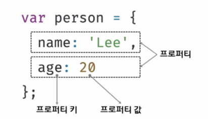

# 객체 리터럴

## 01. 객체란?

- 자바스크립트는 객체 기반 프로그래밍 언어
- 객체 타입은 다양한 타입의 값을 하나의 단위로 구성한 복합적인 자료구조
- **원시 값은 변경 불가능한 값이지만 객체 타입의 값은 변경 가능한 값**
- 객체는 0개 이상의 프로퍼티로 구성된 집합, 프로퍼티는 키와 값으로 구성
  
- 객체는 프로퍼티와 메서드로 구성된 집합체

  - 프로퍼티: 객체 상태를 나타내는 값
  - 메서드: 프로퍼티를 참조하고 조작할 수 있는 동작

## 02. 객체 리터럴에 의한 객체 생성

- 객체 리터럴은 중괄호 내에 0개 이상의 프로퍼티를 정의
- 변수에 할당되는 시점에 자바스크립트 엔진은 객체 리터럴을 해석해 객체를 생성

```js
var person = {
  name: "Baek",
  sayHello: function () {
    console.log(`Hello!, My name is ${this.name}`);
  },
};

console.log(typeof person); // object
console.log(person); // {name: "Baek", sayHello: f}
```

- 객체 리터럴의 중괄호는 코드 블록을 의미하지 않음
- 따라서 값으로 평가되는 값이므로 닫는 중괄호 뒤에 세미콜론 붙임

## 03. 프로퍼티

- **객체는 프로퍼티의 집합이며, 프로퍼티는 키와 값으로 구성**
- 프로퍼티

  - 프로퍼티 키: 빈 문자열을 포함하는 모든 문자열 또는 심벌 값

    - 프로퍼티 값에 접근할 수 있는 이름
    - 식별자 역할

  - 프로퍼티 값: 자바스크립트에서 사용할 수 있는 모든 값

- 프로퍼티 키

  - 네이밍 규칙을 준수한 경우에만 따옴표 생략 가능
  - 프로퍼티 키를 동적으로 생성하는 경우에는 대괄호로 묶기
  - 숫자 리터럴을 사용하면 내부적으로 문자열로 변환
  - 예약어를 키로 사용하면 에러가 발생하지 않지만 에러 발생 여지가 생기므로 권장하지 않음
  - 중복 선언하면 나중에 선언한 프로퍼티가 덮어씀

## 04. 메서드

- 프로퍼티 값이 함수일 경우 일반 함수와 구분하기 위해 메서드라고 부름
- 즉, 메서드는 객체에 묶여있는 함수

## 05. 프로퍼티 접근

- 접근 방법
  - 마침표 표기법
  - 대괄호 표기법

좌측에는 객체로 평가되는 표현식 기술, 우측 또는 대괄호에는 프로퍼티 키를 지정

```js
var person = {
  name: "Baek",
};

console.log(person.name);
console.log(person["name"]);
```

대괄호 표기법의 경우 프로퍼티 키는 반드시 따옴표로 감싼 문자열

## 06. 프로퍼티 값 갱신

이미 존재하는 프로퍼티에 값 할당

## 07. 프로퍼티 동적 생성

존재하지 않는 프로퍼티에 값을 할당하면 동적으로 생성되어 추가되고 프로퍼티 값이 할당됨

## 08. 프로퍼티 삭제

delete 연산자로 객체의 프로퍼티 삭제

```js
delete person.name;
```

## 09. ES6에서 추가된 객체 리터럴의 확장 기능

### 프로퍼티 축약 표현

프로퍼티 값으로 변수를 사용하는 경우 이름과 프로퍼티 키가 동일한 이름일 때 프로퍼티 키 생략 가능

```js
// 축약 전 (ES5)
var x = 1,
  y = 2;

var obj = {
  x: x,
  y: y,
};

consol.log(obj);

// 축약 후 (ES6)
let x = 1,
  y = 2;

const obj = { x, y };

console.log(obj);
```

### 계산된 프로퍼티 이름

문자열 또는 문자열로 타입 변환할 수 있는 값으로 평가되는 표현식을 사용해 프로퍼티 키를 동적으로 생성 가능

### 메서드 축약 표현

```js
const obj = {
  name: "Lee",
  sayHi() {
    console.log("Hi! " + this.name);
  },
};

obj.sayHi();
```
