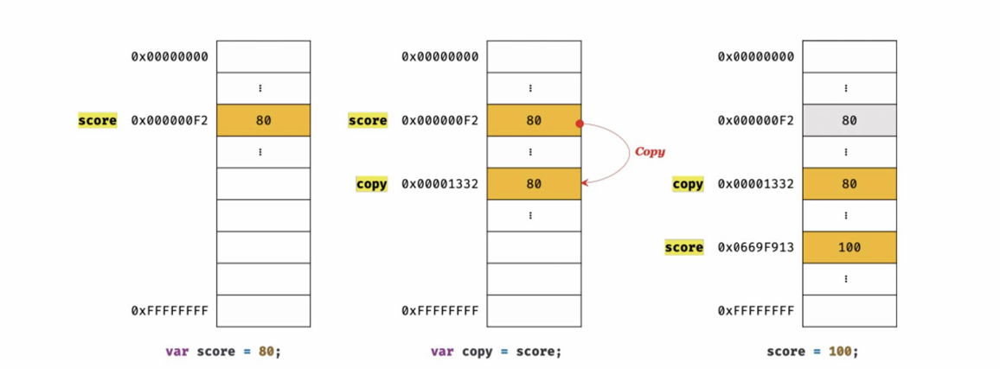
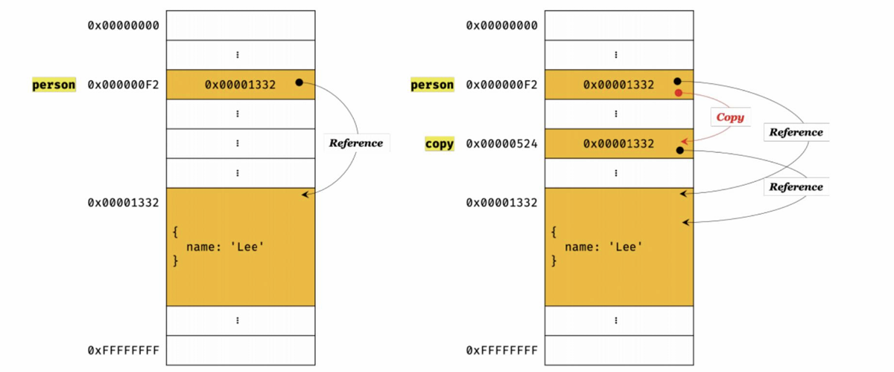

# 원시 값과 객체의 비교

> 💡 원시 타입 vs. 객체 타입<br/>
> 원시값은 변경 불가능한 값, 객체는 변경 가능한 값<br/>
> 원시값을 변수에 할당하면 변수에는 실제 값이 저장되고, 객체를 변수에 할당하면 변수에는 참조값이 저장<br/>
> 원시값을 갖는 변수를 다른 변수에 할당하면 원본의 원시값이 복사되어 전달(**값에 의한 전달**)되고, 객체를 가리키는 변수를 다른 변수에 할당하면 원본의 참조값이 복사되어 전달(**참조에 의한 전달**)

## 01. 원시값

### 변경 불가능한 값

- 변경이 불가능한 것은 변수가 아니라 값
- 상수 ≠ 변경 불가능한 값

  - 상수는 재할당이 금지된 변수

- 원시 값은 변경 불가능한 값, 읽기 전용 값
- 따라서 데이터 신뢰성 보장

### 문자열과 불변성

- 문자열은 몇 개의 문자로 이뤄졌느냐에 따라 필요한 메모리 공간의 크기가 결정됨
- 자바스크립트의 경우 다른 언어와 달리 원시 타입인 문자열 타입을 제공
- 이 또한 변경 불가능
- 문자열은 유사배열객체
  > 유사배열객체란 배열처럼 인덱스로 프로퍼티 값에 접근할 수 있고 length 프로퍼티를 갖는 객체
- 기존 문자열을 변경하는 것은 불가능하나 새로운 문자열을 재할당은 가능

### 값에 의한 전달

```js
var score = 80;
var copy = score;

console.log(score); // 80
console.log(copy); // 80

score = 100;

console.log(score); // 100
console.log(copy); // 80
```



- score 변수와 copy 변수의 값 80은 다른 메모리 공간에 저장된 별개의 값
- 따라서 score 변수의 값을 변경해도 copy 변수의 값에는 어떤 영향도 주지 않음
- 즉, 값에 의한 전달은 값을 전달하는 것이 아니라 메모리 주소를 전달

## 02. 객체

- 프로퍼티 갯수가 정해져 있으며 동적으로 추가, 삭제 가능
- 프로퍼티의 값에 제약 X
- 따라서 확보해야할 메모리 공간의 크기를 미리 정할 수 X

### 변경 가능한 값

- 객체는 원시 값과 달리 재할당 없이 변경 가능한 값

  - 프로퍼티를 동적으로 추가, 갱신, 삭제 가능
  - 재할당 하지 않으면 참조 값이 변경되지 X

- 메모리 주소를 통해 메모리 공간에 접근하면 원시 값에 접근할 수 있음
- 하지만 객체를 할당한 변수가 기억하는 메모리 주소를 통해 메모리 공간에 접근하면 참조 값에 접근 가능
- 참조 값은 생성된 객체가 저장된 메모리 공간의 주소 그 자체
- 여러 개의 식별자가 하나의 객체를 공유 가능

### 참조에 의한 전달

```js
var person = {
  name: "Baek",
};

// 얕은 복사
var copy = person;
```



- person을 다른 변수 copy에 할당하면 참조값이 복사되어 전달됨
- 메모리 주소는 서로 다르지만 동일한 참조값을 가짐
- 두 개의 식별자가 하나의 객체를 공유
- 어느 한 쪽에서 객체를 변경하면 서로 영향을 주고 받음
- 자바스크립트에는 값에 의한 전달만 존재
