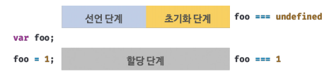
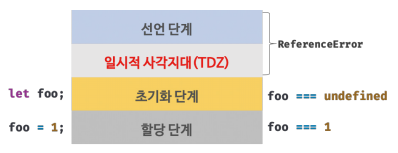

# 15장 let, const 키워드와 블록 레벨 스코프

## 목차

1. [var 키워드로 선언한 변수의 문제점](#1-var-키워드로-선언한-변수의-문제점)
2. [let 키워드](#2-let-키워드)
3. [const 키워드](#3-const-키워드)
4. [var vs. let vs. const](#4-var-vs-let-vs-const)

<br />

## 1. var 키워드로 선언한 변수의 문제점

**1. 변수 중복 선언 허용**

var 키워드로 선언한 변수를 중복 선언하면 초기화문 유무에 따라 다르게 동작한다.<br>
초기문이 있는 변수 선언문 : 자바스크립트 엔진에 의해 var 키워드가 없는 것처럼 동작<br>
초기문이 없는 변수 선언문 : 무시

**에러가 발생하지 않는다.**

>만약 동일한 이름의 변수가 이미 선언되어 있는 것을 모르고 변수를 중복 선언하면서 값까지 할당했다면 **의도치 않게 먼저 선언된 변수 값이 변경되는 부작용**이 발생한다.

<br />

**2. 함수 레벨 스코프**

var 키워드로 선언한 변수는 **오로지 함수의 코드 블록만을 지역 스코프**로 인정한다.

>전역 변수를 남발할 가능성을 높인다. 이로 인해 **의도치 않게 전역 변수가 중복 선언**되는 경우가 발생한다.

<br />

**3. 변수 호이스팅**

변수 호이스팅으로 인해 var 키워드로 선언한 변수는 변수 선언문 이전에 참조할 수 있다.<br>
단, 할당문 이전에 변수를 참조하면 언제나 undefined를 반환한다.

> 변수 선언문 이전에 변수를 참조하는 것은 에러를 발생시키지 않지만 **프로그램의 흐름상 맞지 않을뿐더러 가독성을 떨어뜨리고 오류를 발생시킬 여지**를 남긴다.

<br />

## 2. let 키워드

**1. 변수 중복 선언 금지**

**문법 에러(SyntaxError)가 발생**한다.

<br />

**2. 블록 레벨 스코프**

**모든 코드 블록**(함수, if 문, for 문, while 문, try/catch 문 등)을 지역 스코프로 인정한다.

<br />

**3. 변수 호이스팅**

var 키워드로 선언한 변수와 달리 let 키워드로 선언한 변수는 **변수 호이스팅이 발생하지 않는 것처럼** 동작한다.

let 키워드로 선언한 변수를 변수 선언문 이전에 참조하면 **참조 에러(ReferenceError)가** 발생한다.

var 키워드로 선언한 변수는 런타임 이전에 자바스크립트 엔진에 의해 암묵적으로 "선언 단계"와 "초기화 단계"가 한번에 진행 된다.



> let 키워드로 선언한 변수는 "선언 단계"와 "초기화 단계"가 분리되어 진행된다. 즉, 런타임 이전에 자바스크립트 엔진에 의해 암묵적으로 선언 단계가 먼저 실행되지만 초기화 단계는 변수 선언문에 도달했을 때 실행된다.

let 키워드로 선언한 변수는 스코프의 시작 지점부터 초기화 단계 시작 지점(변수 선언문)까지 변수를 참조할 수 없다. 그 구간을 **일시적 사각지대**(Temporal Dead Zone:TDZ)라고 부른다.



let 키워드로 호이스팅일 일어난다는 사실을 알 수 있는 예시

let 키워드로 선언한 변수의 경우 변수 호이스팅이 발생하지 않는다면 아래 예제에서 전역 변수 foo의 값을 출력해야 한다. 하지만 호이스팅이 발생하기 때문에 참조에러가 발생한다.

```js
let foo = 1; // 전역 변수

{
  console.log(foo); // ReferenceError: Cannot access 'foo' before initialization
  let foo = 2; // 지역 변수
}
```

자바스크립트는 모든 선언을 호이스팅한다. 단, ES6에서 도입된 let, const, class를 사용한 선언문은 호이스팅이 발생하지 않는 것처럼 동작한다.

<br />

**4. 전역 객체와 let**

var 키워드로 선언한 전역 변수와 전역 함수, 그리고 선언하지 않은 변수에 값을 할당한 암묵적 전역은 전역 객체 window의 프로퍼티가 된다. 전역 객체의 프로퍼티를 참조할 때 window를 생략 할 수 있다.

let 전역 변수는 보이지 않는 개념적인 블록(전역 렉시컬 환경의 선언적 환경 레코드) 내에 존재한다.

// 23장에서 자세히 살펴본다.

<br />

## 3. const 키워드

상수를 선언하기 위해 사용한다. 하지만 상수만을 위해 사용하지는 않는다.

**1. 선언과 초기화**

const 키워드로 선언된 변수는 반드시 선언과 동시에 초기화해야 한다. 그렇지 않으면 문법 에러가 발생한다.

블록 레벨 스코프를 가지며, 변수 호이스팅이 발생하지 않는 것처럼 동작한다.

<br />

**2. 재할당 금지**

<br />

**3. 상수**

상수 : 재할당이 금지된 변수, 상태 유지와 가독성, 유지보수의 편의를 위해 적극 사용

원시 값은 변경 불가능한 값이므로 재할당 없이 값을 변경할 수 있는 방법이 없다. 그리고 const 키워드로 재할당을 금지한다. 이러한 특징을 이용해 const 키워드를 상수를 표현하는데 사용하기도 한다.

일반적으로 상수 이름은 대분자로 선언해 상수임을 명확히 나타낸다. 여러 단어로 이뤄진 경우에는 언더스코어(_)로 구분해서 스네이크 케이스로 표현하는 것이 일반적이다.

**4. const 키워드와 객체**

const 키워드로 선언된 변수에 객체를 할당할 경우 값을 변경할 수 있다.<br>
변경 가능한 값인 객체는 재할당 없이도 직접 변경이 가능하기 때문이다.

const 키워드는 재할당을 금지할 뿐 "불변"을 의미하지 않는다.

<br>

## 4. var vs. let vs. const
변수 선언에는 기본적으로 const를 사용하고 letㅇ은 재할당이 필요한 경우에 한정해 사용하는 것이 좋다. const 키워드를 사용하면 의도치 않은 재할당을 방지하기 때문에 좀 더 안전하다.

- ES6를 사용한다면 var 키워드는 사용하지 않는다.
- 재할당이 필요한 경우에 한정해 let 키워드를 사용한다. 이때 변수의 스코프는 최대한 좁게 만든다.
- 변경이 발생하지 않고 읽기 전용을 사용하는 원시 값과 객체에는 const 키워드를 사용한다. const 키워드는 재할당을 금지하므로 var, let 키워드보다 안전하다.