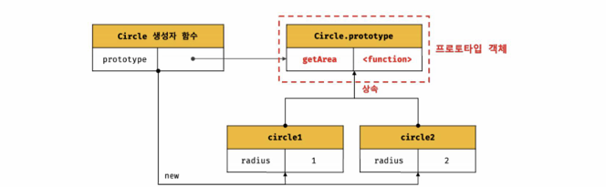
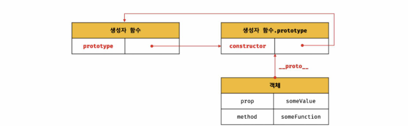
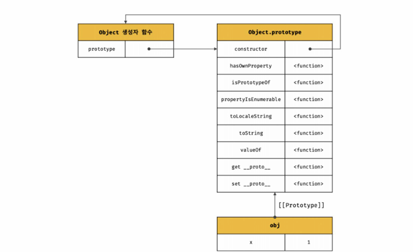
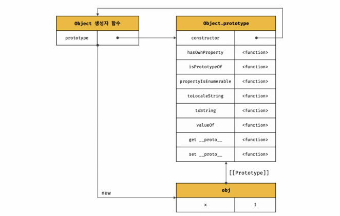
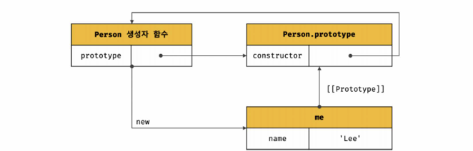

# 프로토타입

## 01. 객체지향 프로그래밍

- 여러 개의 독립적인 단위, 즉 객체의 집합으로 프로그램을 표현하려는 프로그래밍 패러다임
- **추상화** : 다양한 속성 중에서 프로그램에 필요한 속성만 간추려 표현
- 객체 : 속성을 통해 여러 개의 값을 하나의 단위로 구성한 복합적인 자료구조 or 상태 데이터와 동작을 하나로 묶은 복합적인 자료구조

  - 객체의 상태 : 프로퍼티
  - 동작 : 메서드

```js
const person = {
  name: "Baek",
  address: "Daegu",
};
```

## 02. 상속과 프로토타입

- 상속 : 어떤 객체의 프로퍼티 또는 메서드를 다른 객체가 상속받아 그대로 사용할 수 있는 것

  - 기존 코드 재사용을 통한 중복 제거
  - 개발 비용 절감
  - 프로토타입 기반의 상속 구현
    

## 03. 프로토타입 객체

- 객체 간 상속을 구현하기 위해 사용됨
- 어떤 객체의 상위(부모) 객체의 역할을 하는 객체로서 다른 객체에 공유 프로퍼티를 제공
- 객체가 생성될 때 객체 생성 방식에 따라 프로토타입이 결정되고 [[Prototype]] (내부슬롯)에 저장됨
- 모든 객체는 하나의 프로토타입을 가지고, 모든 프로토타입은 생성자 함수와 연결되어 있음

  

### **proto** 접근자 프로퍼티

- 모든 객체는 **proto** 접근자 프로퍼티를 통해 자신의 프로토타입, 즉 [[Prototype]] 내부 슬롯에 접근 가능
- 프로토타입 체인은 단방향 링크드 리스트로 구현되어야 함 (무한루프 방지)

### 함수 객체의 prototype 프로퍼티

- 함수 객체만이 소유하는 prototype 프로퍼티는 생성자 함수가 생성할 인스턴스의 프로토타입을 가리킴
- 따라서 생성자 함수로서 호출할 수 없는 함수인 non-constructor인 ㅘ살표 함수와 ES6 메서드 축약 표현으로 정의한 메서드는 prototype 프로퍼티를 소유하지 X, 생성하지도 X

```js
// 함수 객체는 prototype 프로퍼티를 소유
(function () {}).hasOwnProperty("prototype"); // true
// 일반 객체는 prototype 프로퍼티를 소유 X
({}).hasOwnProperty("prototype"); // false
```

## 05. 프로토타입의 생성 시점

- 생성자 함수가 생성되는 시점에 생성됨
- 프로토타입과 생성자 함수는 단독으로 존재할 수 없고 항상 쌍으로 존재
- 생성자 함수는 사용자가 직접 정의한 사용자 정의 생성자 함수와 자바스크립트가 기본 제공하는 빌트인 생성자 함수로 구분

### 사용자 정의 생성자 함수와 프로토타입 생성 시점

- 생성자 함수로서 호출할 수 있는 함수, 즉 constructor는 함수 정의가 평가되어 함수 객체를 생성하는 시점에 프로토타입도 더불어 생성됨

  ```js
  console.log(Person.prototype); // {constructor: f}

  // 생성자 함수
  function Person(name) {
    this.name = name;
  }
  ```

- non-constructor는 프로토타입이 생성되지 않음

  ```js
  // 화살표 함수는 non-constructor
  const Person = (name) => {
    this.name = name;
  };

  // non-constructor는 프로토타입이 생성되지 X
  ```

- 생성된 프로토타입은 오직 constructor 프로퍼티만을 갖는 객체인데 프로토타입도 객체이고 모든 객체는 프로토타입을 가지므로 프로토타입도 자신의 프로토타입을 가짐
- 생성된 프로토타입의 프로토타입은 **Object.prototype**
- 즉, 사용자 정의 생성자 함수는 자신이 평가되어 함수 객체로 생성되는 시점에 프로토타입이 생성되며, 생성된 프로토타입은 언제나 **Object.prototype**

### 빌트인 생성자 함수와 프로토타입 생성 시점

- 빌트인 함수: Object, String, Number, Function, Array, RegExp, Date, Promise ... etc
- 전역 객체가 생성되는 시점에 프로토타입 생성

  - 전역 객체

    - 코드 실행 이전 단계에 js 엔진에 의해 생성되는 특수 객체
    - 클라이언트 사이드 환경에서는 window, 서버 사이드 환경에서는 global 객체를 의미

- 생성된 프로토타입은 빌트인 생성자 함수의 prototype 프로퍼티에 바인딩 됨
- 생성자 함수 또는 리터럴 표기법으로 객체 생성 시, 프로토타입은 생성된 객체의 [[Prototype]] 내부 슬롯에 할당됨
- 이렇게 생성된 객체는 프로토타입을 상속받음

## 06. 객체 생성 방식과 프로토타입의 결정

- 객체 생성 방식

  - 객체 리터럴
  - Object 생성자 함수
  - 생성자 함수
  - Object.create 메서드
  - 클래스(ES6)

- 위 모든 방식이 추상 연산 OrdinaryObjectCreate에 의해 생성됨

  - OrdinaryObjectCreate

    - 필수적으로 자신이 생성할 객체의 프로토타입을 인수로 전달받음
    - 자신이 생성할 객체에 추가할 프로퍼티 목록을 옵션으로 전달 할 수 있음

- 즉, 프로토타입은 추상 연산 OrdinaryObjectCreate에 전달되는 인수에 의해 결정됨
- 인수는 객체가 생성되는 시점에 객체 생성 방식에 의해 결정됨

### 객체 리터럴에 의해 생성된 객체의 프로토타입



### Object 생성자 함수에 의해 생성된 객체의 프로토타입



### 생성자 함수에 의해 생성된 객체의 프로토타입



## 07. 프로토타입 체인

- 객체의 프로퍼티에 접근하려고 할 때 해당 객체에 접근하려는 프로퍼티가 없다면 [[Prototype]] 내부 슬롯의 참조를 따라 자신의 부모 역할을 하는 프로토타입이 프로퍼티를 순차적으로 검색
- 즉, 객체 간의 상속 관계로 이루어진 프로토타입의 계층적인 구조에서 객체의 프로퍼티를 검색
- 프로토타입 체인은 js가 객체지향 프로그래밍의 상속과 프로퍼티 검색을 위한 메커니즘
- 식별자는 스코프 체인에서 검색

## 08. 오버라이딩과 프로퍼티 섀도잉

- 프로퍼티 섀도잉

  - 상속 관계에 의해 프로퍼티가 가려지는 현상

- 오버라이딩

  - 상위 클래스가 가지고 있는 메서드를 하위 클래스가 재정의하여 사용하는 방식

## 10. instanceof 연산자

- 이항 연산자
- 좌변에 객체를 가리키는 식별자, 우변에 생성자 함수를 가리키는 식별자

```js
객체 instanceof 생성자 함수
```

- 우변의 생성자 함수의 prototype에 바인딩 된 객체가 좌변의 객체의 프로토타입 체인 상에 존재하면 true, 존재하지 않으면 false

## 11. 직접 상속

### Object.create에 의한 직접 상속

- 명시적으로 프로토타입을 지정하여 새로운 객체 생성
- 추상 연산 OrdinaryObjectCreate를 호출
- 첫 번째 매개변수에 생성할 객체의 프로토타입으로 지정한 객체를 전달
- 두 번째 매개변수에 생성할 객체의 프로퍼티 키, 프로퍼티 디스크립터 객체로 이루어진 객체를 전달 (옵션)

```js
Object.create(prototype[, propertiesObject])
```

- 장점

  - new 연산자 없이 객체 생성 가능
  - 프로토타입을 지정하면서 객체 생성 가능
  - 객체 리터럴에 의해 생성된 객체도 상속받기 가능

### 객체 리터럴 내부에서 **proto**에 의한 직접 상속

- Object.create에 의한 직접 상속은 두 번째 인자로 프로퍼티를 정의하는 것이 번거로움
- 따라서 **proto** 접근자 프로퍼티를 통해 직접 상속

## 13. 프로퍼티 존재 확인

### in 연산자

- 객체 내 프로퍼티가 존재하는지 확인

```js
// key: 프로퍼티 키
// object: 객체로 평가되는 표현식
key in object;
```

- or Reflect.has 메서드 사용

### Object.prototype.hasOwnProperty 메서드

```js
console.log(person.hasOwnProperty("name"));
```

## 14. 프로퍼티 열거

### for ... in문

```js
for (변수선언문 in 객체) {...}
```

- 프로퍼티 어트리뷰트 [[Enumerable]]의 값이 true인 프로퍼티를 프로퍼티 갯수만큼 순회
