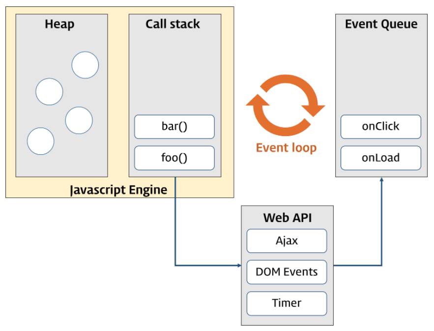

# 42장 비동기 프로그래밍

## 목차

1. [동기 처리와 비동기 처리](#1-동기-처리와-비동기-처리)
2. [이벤트 루프와 태스크 큐](#2-이벤트-루프와-태스트-큐)

<br />

## 1. 동기 처리와 비동기 처리

콜 스택에 함수 실행 컨텍스트가 푸시되는 것은 바로 함수 실행의 시작을 의미한다.

함수가 호출된 순서대로 순차적으로 실행되는 이유는 함수가 호출된 순서대로 함수 실행 컨텍스트가 콜 스택에 푸시되기 때문이다.

**자바스크립트 엔진은 단 하나의 콜 스택을 갖는다.** 즉, 한 번에 하나의 태스크만 실행할 수 있는 **싱글 스레드** 방식으로 동작한다.

현재 실행 중인 태스크가 종료할 때까지 다음에 실행될 태스크가 대기하는 방식을 **동기(synchronous) 처리**라고 한다.

동기 처리 방식은 태스크의 실행 순서가 보장된다는 장점이 있지만, 앞선 태스크가 종료할 때까지 이후 태스크들이 **블로킹**(작업 중단)되는 단점이 있다.

```js
function sleep(func, delay) {
  const delayUntil = Date.now() + delay;

  while (Date.now() < delayUntil);

  func();
}

function foo() {
  console.log('foo');
}

function bar() {
  console.log('bar');
}

sleep(foo, 3 * 1000);
bar();
// (3초 경과 후) foo -> bar
```

<br />

동기와 반대되는 개념으로 비동기가 있다. `setTimeout`은 대표적인 비동기 처리 방식이다.

```js
function foo() {
  console.log('foo');
}

function bar() {
  console.log('bar');
}

setTimeout(foo, 3 * 1000);
bar();
// bar -> (3초 경과 후) -> foo
```

<br />

## 2. 이벤트 루프와 태스트 큐

이벤트 루프는 브라우저에 내장되어 싱글 스레드로 동작하는 자바스크립트의 동시성을 지원한다.

브라우저 환경은 다음과 같다.


> 📜 **콜 스택(call stack)**
>
> 소스코드(전역 코드나 함수 코드 등) 평가 과정에서 생성된 실행 컨텍스트가 추가되고 제거되는 스택 자료구조다.
>
> 함수를 호출하면 함수 실행 컨텍스트가 순차적으로 콜 스택에 푸시되어 순차적으로 실행된다.

> 📜 **힙(heap)**
>
> 객체가 저장되는 메모리 공간이다. 콜 스택의 요소인 실행 컨텍스트는 힙에 저장된 객체를 참조한다.
>
> 객체는 크기가 정해져 있지 않으므로 할당해야 할 메모리 공간의 크기를 런타임에 결정해야 한다. 따라서 힙은 구조화되어 있지 않다는 특징이 있다.

<br />

`setTimeout`의 콜백 함수의 평가와 실행은 자바스크립트 엔진이 담당하지만 호출 스케줄링을 위한 타이머 설정과 콜백 함수의 등록은 브라우저 또는 Node.js가 담당한다. 이를 위해 브라우저 환경은 태스크 큐와 이벤트 루프를 제공한다.

> 📜 **태스크 큐(task queue/event queue/callback queue)**
>
> `setTimeout`이나 `setInterval`과 같은 비동기 함수의 콜백 함수 또는 이벤트 핸들러가 일시적으로 보관되는 영역이다. 태스크 큐와는 별도로 프로미스의 후속 처리 메서드의 콜백 함수가 일시적으로 보관되는 마이크로태스크 큐도 존재한다.

> 📜 **이벤트 루프(event loop)**
>
> 콜 스택에 현재 실행 중인 실행 컨텍스트가 있는지, 그리고 태스크 큐에 대기 중인 함수(콜백 함수, 이벤트 함수 등)가 있는지 반복해서 확인한다. 만약 **콜 스택이 비어 있고 태스크 큐에 대기 중인 함수가 있다면 이벤트 루프는 순차적(FIFO; First In First Out)으로 태스크 큐에 대기 중인 함수를 콜 스택으로 이동시킨다.** 이때 콜 스택으로 이동한 함수는 실행된다.

<br />

자바스크립트 엔진은 싱글 스레드로 동작한다. 브라우저는 멀티 스레드로 동작한다.

브라우저와 자바스크립트 엔진이 협력하여 비동기를 구현하고 싱글 스레드의 단점을 극복한다.
